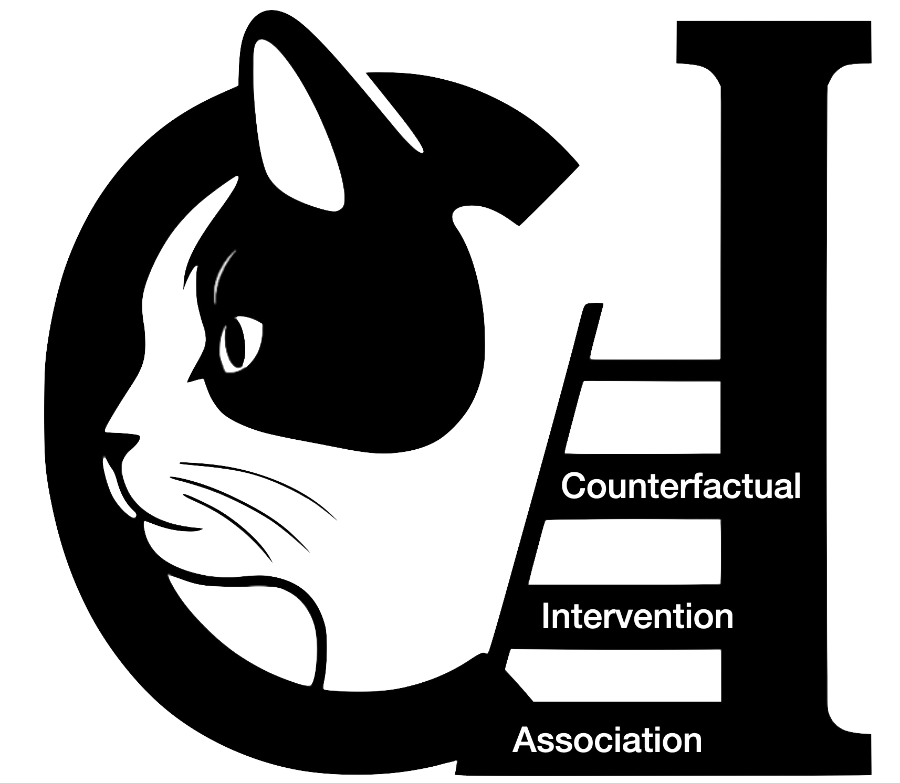

<h1>
 Joint Graph Learning for Robust Causal Inference over Knowledge Graphs
</h1>

BaLu is a Framework for Causal Inference over Knowledge Graphs under Data Incompleteness and Interference Assumption using Python.

## Supplementary Material
Check the `Supplementary.pdf`.

## Source Code
The source code of **BaLu** is in the folder: `BaLu_Plus`;

The implementation of GNN-HSIC is in the folder: `GCN_policy_ma`;

The implementation of NetDeconf is in the folder: `NetDeconf_main`;

The implementation of SPNet is in the folder: `SPNet-main`;

Other causal inference methods are implemented in the folder: `OtherMethods`;

The data impuatation method of GRAPE is in the folder: `GRAPE-imputer`;

Other imputation methods are implemented and used in the folder: `Data-BaLu`. 

## Datasets
The original benchmarks of the **BlogCatalog** and **Flickr** can be found [here](https://github.com/rguo12/network-deconfounder-wsdm20/tree/master/datasets), the **Youtube** can be found [here](https://github.com/LINXF208/HINITE/tree/main/data). The datasets of **Instagram** can be simulated using [Data-BaLu/synetic_simulation/syn_instagram.py](https://anonymous.4open.science/r/BaLu-E932/Data-BaLu/synetic_simulation/syn_instagram.py). 

We do not offer here all the dataset instances under different missing percentages ($p_{\text{miss}}\in\{0.0, 0.1, 0.3\}$) because of limited space of the repository. But readers can use the code in `Data-BaLu` to create all dataset instances. 

For each dataset (**Instagram, Youbute, BlogCatalog, Flickr**), each data missing rate $p_{\text{miss}}$, and each data imputation method (Mean, KNN, MissForest, MICE, GAIN, and GRAPE), we have 10 different datasets, which result in 4 + 4*2*6*10= 484 instances of dataset. 

## Results
All experimental results are stored in the two folders: `results/results_balu_tuning` for results of our BaLu methods, `results/results_others` for all other baselines.

1. The visual presentation corresponding to Figure 3 in the paper can be found in [results/step 6: visualize_Q1_boxplots.ipynb](https://anonymous.4open.science/r/BaLu-E932/results/step%206:%20visualize_Q1_boxplots.ipynb)

2. The visual presentation corresponding to Table 2 in the paper can be found in [results/step 5: visualize_other_results.ipynb](https://anonymous.4open.science/r/BaLu-E932/results/step%205:%20visualize_other_results) and [step 3: visualize_balu_tuning_Relational_Message.ipynb](https://anonymous.4open.science/r/BaLu-E932/results/step%203:%20visualize_balu_tuning_Relational_Message.ipynb) (we also report the results under data incomplete scenario of $p_{\text{miss}}=0.3$ which are not included in the paper). 

3. The visual presentation corresponding to Figure 4 in the paper can be found in [results/step 4: visualize_balu_tuning_beta.ipynb](https://anonymous.4open.science/r/BaLu-E932/results/step%204:%20visualize_balu_tuning_beta.ipynb), [step 4: visualize_balu_tuning_gamma.ipynb](https://anonymous.4open.science/r/BaLu-E932/results/step%204:%20visualize_balu_tuning_gamma.ipynb), and [step 4: visualize_balu_tuning_eta.ipynb](https://anonymous.4open.science/r/BaLu-E932/results/step%204:%20visualize_balu_tuning_eta.ipynb). 

4. We also tested (1) different choice of L and K; and (2) different convolutional layers, the visual presentation can be found in [results/step 1 visualize_balu_results_L_K_Layer.ipynb](https://anonymous.4open.science/r/BaLu-E932/results/step%201%20visualize_balu_results_L_K_Layer.ipynb) and [results/step 2: visualize_balu_tuning_GNN_choose.ipynb](https://anonymous.4open.science/r/BaLu-E932/results/step%202:%20visualize_balu_tuning_GNN_choose.ipynb), where the `BaLu_GRAPE`, `BaLu_IGMC`, and `GRAPE` represent the different variants of our methods: **BaLu, BaLu (-edge), BaLu(-rel)**, respectively.

