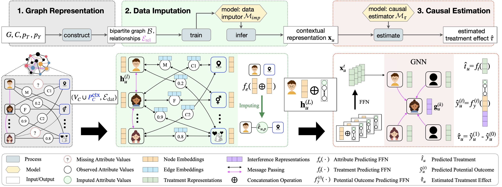
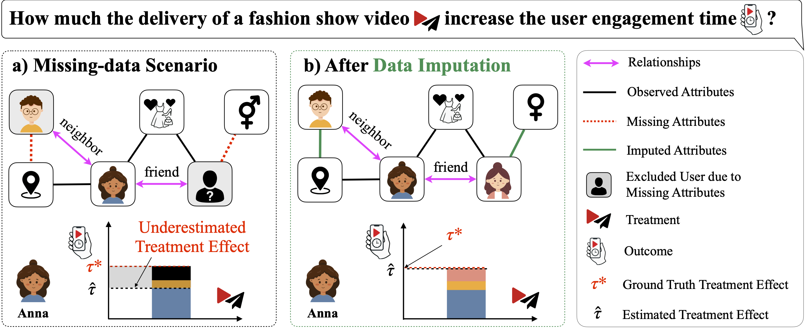
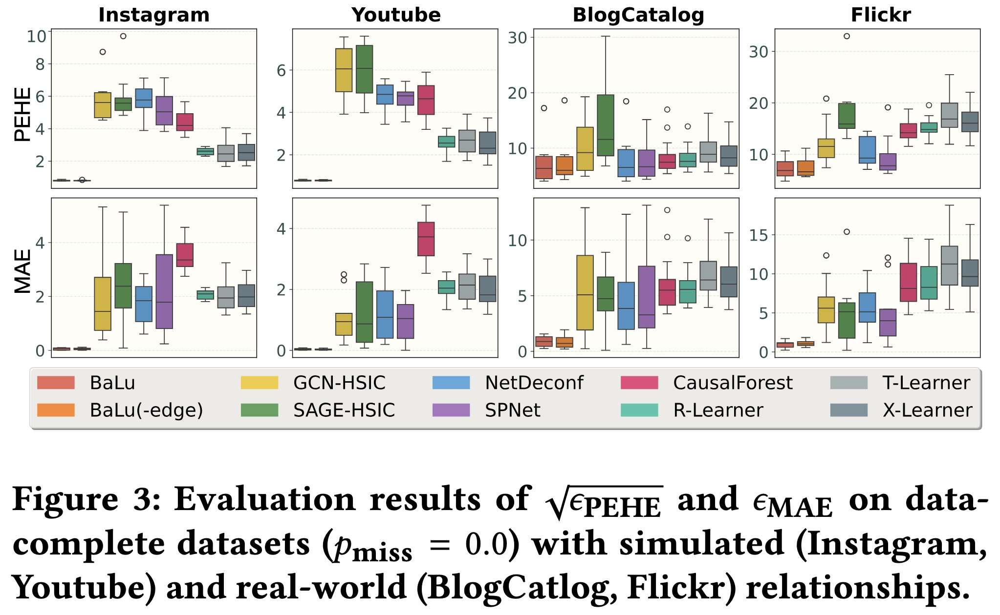
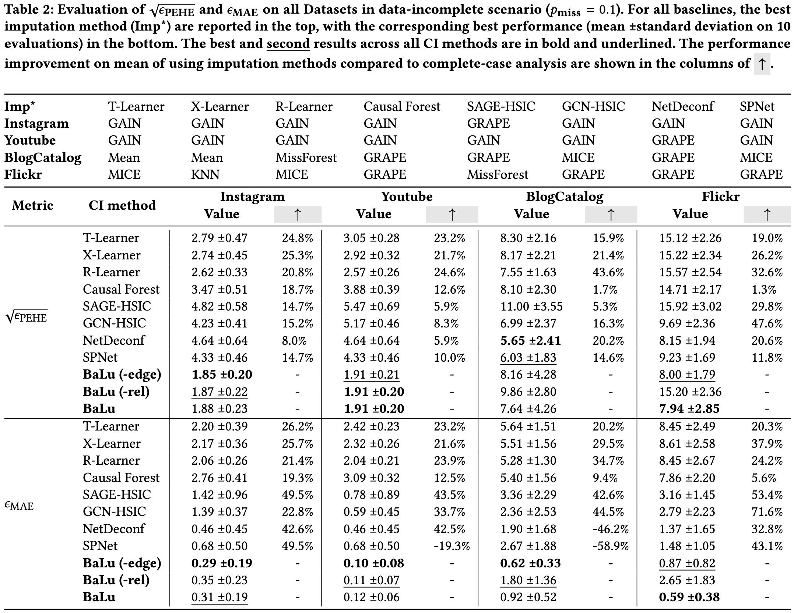

> ⚠️ **Project moved:** https://github.com/SDM-TIB/BaLu-WSDM2026  
> Please open Issues and Pull Requests in the SDM-TIB repository.

<div align="center">
  <a href="https://econml.azurewebsites.net/">
    
  </a>

  <h1>BaLu: Joint Graph Learning for Robust Causal Inference over Knowledge Graphs</h1>

  <p>
    <strong>Hao Huang</strong> (TIB/LUH) & <strong>Maria-Esther Vidal</strong> (TIB/L3S/LUH)
  </p>

  <p>
  <a href="https://doi.org/10.1145/3773966.3777980">
    
  </a>

  <a href="https://dl.acm.org/doi/10.1145/3773966.3777980">
    
  </a>

  <a href="https://www.python.org/">
    
  </a>
  <a href="https://pytorch.org/">
    
  </a>
  <a href="#citation">
    
  </a>
</p>

  <h3>
    <a href="#-overview">Overview</a> •
    <a href="#-repository-structure">Structure</a> •
    <a href="#-datasets">Datasets</a> •
    <a href="#-results-preview">Results</a> •
    <a href="#-reproduction--results">Reproduction</a> •
    <a href="#-citation">Citation</a>
  </h3>
</div>

---

## 📖 Overview

**BaLu** is a Framework for Causal Inference over Knowledge Graphs (KGs) that addresses two fundamental challenges in real-world data: **Data Incompleteness** (Open-World Assumption) and **Interference** (SUTVA violation).

Existing methods often assume fully observed data or fail to model inter-unit dependencies. **BaLu** reformulates causal inference as two interconnected tasks via Graph Neural Networks (GNNs):
1.  **Attribute Imputation:** Modeled as an edge prediction task between units and attributes.
2.  **Treatment Effect Estimation:** Modeled as a node prediction task that accounts for interference through relational message passing.

<div align="center">
  
  <br>
  <em>Figure: The BaLu Framework Architecture (Imputation + Causal Estimation).</em>
</div>

### Why is this necessary?
As shown in the motivating example below, excluding users with missing attributes (e.g., standard "complete-case analysis") leads to biased populations and neglected interference paths. BaLu restores these connections to provide robust Average Treatment Effect (ATE) and Individual Treatment Effect (ITE) estimates.

<div align="center">
  
  <br>
  <em>Figure: Imputation improves treatment effect estimation by restoring connections under interference.</em>
</div>

---

## 📂 Repository Structure

The implementation is organized as follows:

```text
.
├── BaLu_Plus/              # 🚀 Source code for BaLu (Main Framework)
├── GCN_policy_ma/          # Implementation of GNN-HSIC baseline
├── NetDeconf_main/         # Implementation of NetDeconf baseline
├── SPNet-main/             # Implementation of SPNet baseline
├── OtherMethods/           # Baselines: T/X/R-Learners, CausalForest
├── GRAPE-imputer/          # Imputation method: GRAPE
├── Data-BaLu/              # 💾 Data generation & imputation scripts
│   └── synetic_simulation/ # Scripts for synthetic datasets (Instagram)
├── results/                # 📊 Jupyter Notebooks for visualization & tables
└── Supplementary.pdf       # Supplementary material (Proofs & Extras)
```

## 💾 Datasets

We evaluate on four benchmark datasets. Due to repository size limits, we provide the generators and scripts to reconstruct the full dataset instances (484 instances total across missing rates and seeds).

| Dataset | Type | Entities | Relationships |
| :--- | :--- | :--- | :--- |
| **Instagram** | Synthetic | 5,000 | Simulated |
| **YouTube** | Synthetic | 5,000 | Simulated |
| **BlogCatalog** | Real-world | 5,196 | Real-world |
| **Flickr** | Real-world | 7,575 | Real-world |

**Generation:**
* Use the code in `Data-BaLu` to create all dataset instances.
* The **Instagram** simulation script is located at: `Data-BaLu/synetic_simulation/syn_instagram.py`.
* Original benchmarks for BlogCatalog/Flickr can be found [here](https://github.com/rguo12/network-deconfounder-wsdm20/tree/master/datasets).

---

## 📊 Results Preview

<details>
<summary><b>(a) Results on complete data (no missing attributes)</b></summary>



</details>

<details>
<summary><b>(b) Results under missing attributes</b></summary>



</details>

---

## 🚀 Reproduction & Results

All experimental results are stored in the `results/` folder. We provide Jupyter Notebooks to reproduce the figures and tables presented in the WSDM '26 paper.

### 1. Main Results (Paper Table 2)
To visualize the performance comparison against baselines:
* [results/step 5: visualize_other_results.ipynb](./results/step%205:%20visualize_other_results.ipynb)
* [results/step 3: visualize_balu_tuning_Relational_Message.ipynb](./results/step%203:%20visualize_balu_tuning_Relational_Message.ipynb)
    * *Note: These notebooks also report results for $p_{\text{miss}}=0.3$ which were omitted from the main paper due to space.*

### 2. Boxplots (Paper Figure 3)
To generate the visual presentation of distribution results:
* [results/step 6: visualize_Q1_boxplots.ipynb](./results/step%206:%20visualize_Q1_boxplots.ipynb)

### 3. Hyperparameter Sensitivity (Paper Figure 4)
To visualize the tuning of $\beta$, $\gamma$, and $\eta$:
* [results/step 4: visualize_balu_tuning_beta.ipynb](./results/step%204:%20visualize_balu_tuning_beta.ipynb)
* [results/step 4: visualize_balu_tuning_gamma.ipynb](./results/step%204:%20visualize_balu_tuning_gamma.ipynb)
* [results/step 4: visualize_balu_tuning_eta.ipynb](./results/step%204:%20visualize_balu_tuning_eta.ipynb)

### 4. Ablation Studies
To test different choices of layers (L), neighbors (K), and GNN architectures:
* [results/step 1 visualize_balu_results_L_K_Layer.ipynb](./results/step%201%20visualize_balu_results_L_K_Layer.ipynb)
* [results/step 2: visualize_balu_tuning_GNN_choose.ipynb](./results/step%202:%20visualize_balu_tuning_GNN_choose.ipynb)
    * *Includes variants: `BaLu_GRAPE` (Full), `BaLu_IGMC` (-edge), and `GRAPE` (-rel).*

---

## 📄 Citation

If you use **BaLu**, this code, or the provided datasets in your research, please cite our **WSDM '26** paper:

```bibtex
@inproceedings{huang2026balu,
  author    = {Huang, Hao and Vidal, Maria-Esther},
  title     = {Joint Graph Learning for Robust Causal Inference over Knowledge Graphs},
  booktitle = {Proceedings of the Nineteenth ACM International Conference on Web Search and Data Mining (WSDM '26)},
  year      = {2026},
  month     = {February},
  address   = {Boise, ID, USA},
  publisher = {ACM},
  doi       = {10.1145/3773966.3777980},
  isbn      = {979-8-4007-2292-9}
}
```

## 🤝 Acknowledgments

This work was supported by the **TrustKG project** (GA No. P99/2020) and the **Lower Saxony Ministry of Science and Culture (MWK)** via the Volkswagen Foundation’s *zukunft.niedersachsen* program (CAIMed, GA No. ZN4257).

We also thank Dr. Qiang Huang for assistance in reproducing the SPNet baselines.


## Related Repositories

This work builds upon and compares against several open-source libraries and repositories. We acknowledge their contributions to the community:

- **NetDeconf:** [rguo12/network-deconfounder-wsdm20](https://github.com/rguo12/network-deconfounder-wsdm20) (Base for BlogCatalog/Flickr datasets)
    
- **SPNet:** [15754311016/SPNet](https://github.com/15754311016/SPNet)
    
- **GRAPE:** [maxiaoba/GRAPE](https://github.com/maxiaoba/GRAPE)
    
- **EconML:** [microsoft/EconML](https://www.google.com/search?q=https://github.com/microsoft/EconML)
    
- **HINITE:** [LINXF208/HINITE](https://www.google.com/search?q=https://github.com/LINXF208/HINITE) (Source for Youtube dataset structure)
    
- **HyperImpute:** [vanderschaarlab/hyperimpute](https://www.google.com/search?q=https://github.com/vanderschaarlab/hyperimpute)
